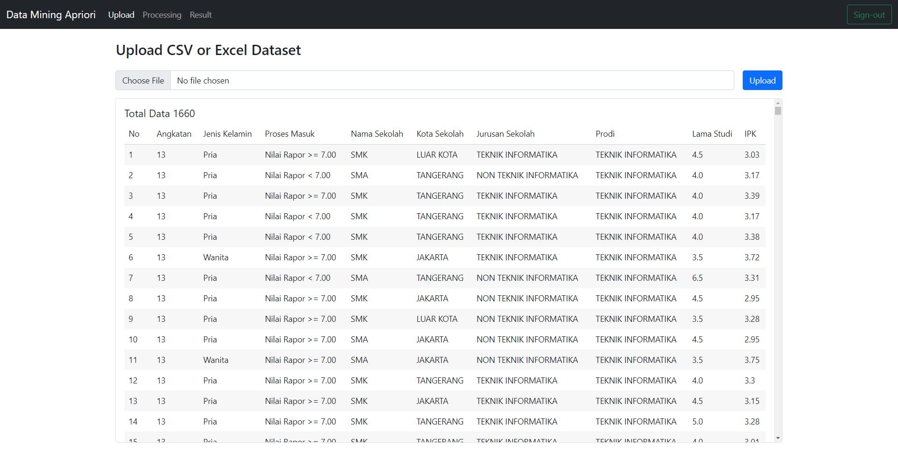

# Data Mining Apriori
Data mining associate rule using apriori algorithm with java spring framework

Function:
1. Upload dataset
2. Processing data
3. Result (show result in table list)
4. Details (show detail result for each process)

Development stack:
* Java 1.7
* Spring MVC Framework
* Spring Security Framework
* Boostrap 5.0
* Mysql Community Edition
* Apache Tomcat 8.0

Available:
1. Frequently itemset
2. Association Rules
3. Calculate Support
4. Calculate Confidence

Output:

* Upload dataset

* Processing

* Summary List

* Summary Details

Reference:

* https://www.javatpoint.com/apriori-algorithm
* https://www.philippe-fournier-viger.com/spmf/AssociationRules.php
* https://codereview.stackexchange.com/questions/125372/mining-association-rules-in-java

EOF.
